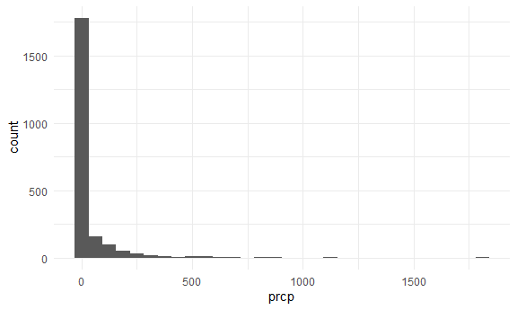
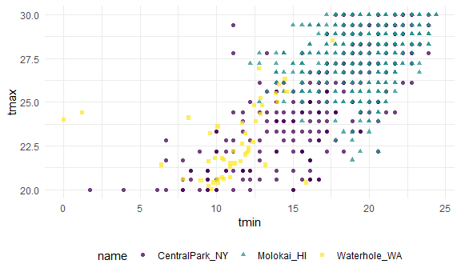
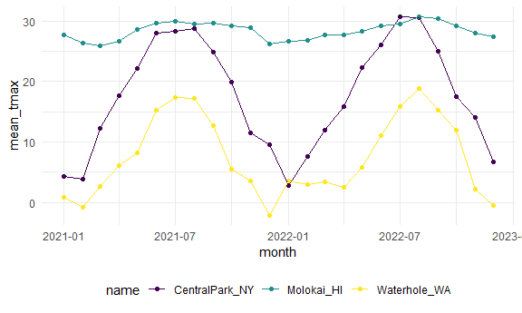
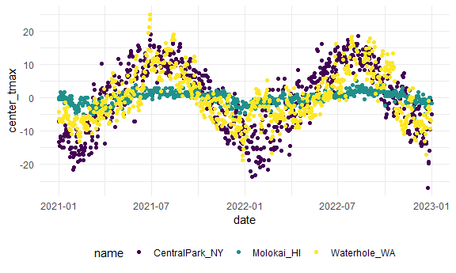

EDA
================
Maliha Safdar
2025-10-02

``` r
library(p8105.datasets)
library(tidyverse)
```

    ## ── Attaching core tidyverse packages ──────────────────────── tidyverse 2.0.0 ──
    ## ✔ dplyr     1.1.4     ✔ readr     2.1.5
    ## ✔ forcats   1.0.0     ✔ stringr   1.5.1
    ## ✔ ggplot2   4.0.0     ✔ tibble    3.3.0
    ## ✔ lubridate 1.9.4     ✔ tidyr     1.3.1
    ## ✔ purrr     1.1.0     
    ## ── Conflicts ────────────────────────────────────────── tidyverse_conflicts() ──
    ## ✖ dplyr::filter() masks stats::filter()
    ## ✖ dplyr::lag()    masks stats::lag()
    ## ℹ Use the conflicted package (<http://conflicted.r-lib.org/>) to force all conflicts to become errors

``` r
library(dplyr)

knitr::opts_chunk$set(
  fig.width = 6,
  fig.asp = .6,
  out.width = "90%"
)

theme_set(theme_minimal() + theme(legend.position = "bottom"))

options(
  ggplot2.continuous.colour = "viridis",
  ggplot2.continuous.fill = "viridis"
)

scale_colour_discrete = scale_colour_viridis_d
scale_fill_discrete = scale_fill_viridis_d
data("weather_df")

weather_df = 
  weather_df |>
  mutate(
    month = lubridate::floor_date(date, unit = "month")) # this was done to round down the dates of each month so feb 23rd becomes feb 1, march 16 becomes march 1. floor_date and lubricate packages help with working with date variables.
```

### Initial numeric explorations

``` r
weather_df |> 
  ggplot(aes(x = prcp)) + 
  geom_histogram()
```

    ## `stat_bin()` using `bins = 30`. Pick better value `binwidth`.

    ## Warning: Removed 15 rows containing non-finite outside the scale range
    ## (`stat_bin()`).


`This is clearly a very skewed distribution; any formal analyses involving preciptation as a predictor or outcome might be influenced by this fact. It’s important to note that the vast majority of days have no precipitation. Meanwhile, examining the relatively few days have very high precipitation might be helpful. SO only looking at extreme values precipitation that are greater than 1000.`

``` r
weather_df |> 
  filter(prcp >= 1000)
```

    ## # A tibble: 3 × 7
    ##   name           id          date        prcp  tmax  tmin month     
    ##   <chr>          <chr>       <date>     <dbl> <dbl> <dbl> <date>    
    ## 1 CentralPark_NY USW00094728 2021-08-21  1130  27.8  22.8 2021-08-01
    ## 2 CentralPark_NY USW00094728 2021-09-01  1811  25.6  17.2 2021-09-01
    ## 3 Molokai_HI     USW00022534 2022-12-18  1120  23.3  18.9 2022-12-01

\`The two high rainfall days in NYC correspond to tropical storm Henri
and hurricane Ida, while the high precipitation day in Molokai took
place during a notable cold front.

A close look at the scatterplot below (which focuses on a range of
values to emphasize this point) suggests that Central Park and Molokai
report temperature values differently from Waterhole …\`

`look at the data again.`

``` r
weather_df |> 
  filter(tmax >= 20, tmax <= 30) |> 
  ggplot(aes(x = tmin, y = tmax, color = name, shape = name)) + 
  geom_point(alpha = .75)
```


`for central park and molokai are happening around tmax = 27.5 and 30.0, and waterhole_wa is in lower tmax, and when we looked deeper in the data it was found that waterhole_wa was measuring temperature in celcius and the otehr two variables measured in celcius too but converted to farenheit.`

### Group_by and Counting things

`Datasets are often comprised of groups defined by one or more (categorical) variable; group_by() makes these groupings explicit so that they can be included in subsequent operations. For example, we might group weather_df by name and month:`

``` r
weather_df |>
  group_by(name, month) # it may seem like no changes happened but it have the Groups: name, month when you check the tibble. Layers on a grouping structure on top. What good does it do? 
```

    ## # A tibble: 2,190 × 7
    ## # Groups:   name, month [72]
    ##    name           id          date        prcp  tmax  tmin month     
    ##    <chr>          <chr>       <date>     <dbl> <dbl> <dbl> <date>    
    ##  1 CentralPark_NY USW00094728 2021-01-01   157   4.4   0.6 2021-01-01
    ##  2 CentralPark_NY USW00094728 2021-01-02    13  10.6   2.2 2021-01-01
    ##  3 CentralPark_NY USW00094728 2021-01-03    56   3.3   1.1 2021-01-01
    ##  4 CentralPark_NY USW00094728 2021-01-04     5   6.1   1.7 2021-01-01
    ##  5 CentralPark_NY USW00094728 2021-01-05     0   5.6   2.2 2021-01-01
    ##  6 CentralPark_NY USW00094728 2021-01-06     0   5     1.1 2021-01-01
    ##  7 CentralPark_NY USW00094728 2021-01-07     0   5    -1   2021-01-01
    ##  8 CentralPark_NY USW00094728 2021-01-08     0   2.8  -2.7 2021-01-01
    ##  9 CentralPark_NY USW00094728 2021-01-09     0   2.8  -4.3 2021-01-01
    ## 10 CentralPark_NY USW00094728 2021-01-10     0   5    -1.6 2021-01-01
    ## # ℹ 2,180 more rows

``` r
weather_df |>
  group_by(name) |>
  summarize(
    n=n()
  ) # now it tells you the number of observations for each variables.
```

    ## # A tibble: 3 × 2
    ##   name               n
    ##   <chr>          <int>
    ## 1 CentralPark_NY   730
    ## 2 Molokai_HI       730
    ## 3 Waterhole_WA     730

``` r
weather_df |>
  group_by(month) |>
  summarize(
    n=n()
  ) # tells you the number of observations by months.
```

    ## # A tibble: 24 × 2
    ##    month          n
    ##    <date>     <int>
    ##  1 2021-01-01    93
    ##  2 2021-02-01    84
    ##  3 2021-03-01    93
    ##  4 2021-04-01    90
    ##  5 2021-05-01    93
    ##  6 2021-06-01    90
    ##  7 2021-07-01    93
    ##  8 2021-08-01    93
    ##  9 2021-09-01    90
    ## 10 2021-10-01    93
    ## # ℹ 14 more rows

``` r
weather_df |>
  group_by(month) |>
  summarize(
    n=n_distinct(date)
  ) # tells you the number of observations by each unique date.
```

    ## # A tibble: 24 × 2
    ##    month          n
    ##    <date>     <int>
    ##  1 2021-01-01    31
    ##  2 2021-02-01    28
    ##  3 2021-03-01    31
    ##  4 2021-04-01    30
    ##  5 2021-05-01    31
    ##  6 2021-06-01    30
    ##  7 2021-07-01    31
    ##  8 2021-08-01    31
    ##  9 2021-09-01    30
    ## 10 2021-10-01    31
    ## # ℹ 14 more rows

`you can count directly`

``` r
weather_df |>
  count(name)
```

    ## # A tibble: 3 × 2
    ##   name               n
    ##   <chr>          <int>
    ## 1 CentralPark_NY   730
    ## 2 Molokai_HI       730
    ## 3 Waterhole_WA     730

`Several important functions respect grouping structures. You will frequently use summarize to create one-number summaries within each group, or use mutate to define variables within groups. The rest of this example shows these functions in action.`

`Because these (and other) functions will use grouping information if it exists, it is sometimes necessary to remove groups using ungroup()`

`There are more interesting summaries below.`

``` r
weather_df |>
  group_by(name,month) |>
  summarize(
    mean_tmax = mean(tmax,na.rm = TRUE),
    median_tmin = median(tmin, na.rm = TRUE),
    sd_prcp = sd(prcp,na.rm = TRUE)
  ) # it tells the mean for tmax and median tmin by name of variable(central park, molokai and waterhole) and the months
```

    ## `summarise()` has grouped output by 'name'. You can override using the
    ## `.groups` argument.

    ## # A tibble: 72 × 5
    ## # Groups:   name [3]
    ##    name           month      mean_tmax median_tmin sd_prcp
    ##    <chr>          <date>         <dbl>       <dbl>   <dbl>
    ##  1 CentralPark_NY 2021-01-01      4.27       -0.5     47.3
    ##  2 CentralPark_NY 2021-02-01      3.87       -1.85    98.1
    ##  3 CentralPark_NY 2021-03-01     12.3         5       71.3
    ##  4 CentralPark_NY 2021-04-01     17.6         8.05    52.4
    ##  5 CentralPark_NY 2021-05-01     22.1        11.1     74.7
    ##  6 CentralPark_NY 2021-06-01     28.1        18.0     43.3
    ##  7 CentralPark_NY 2021-07-01     28.4        21.1    151. 
    ##  8 CentralPark_NY 2021-08-01     28.8        22.2    236. 
    ##  9 CentralPark_NY 2021-09-01     24.8        17.5    333. 
    ## 10 CentralPark_NY 2021-10-01     19.9        13.9    151. 
    ## # ℹ 62 more rows

`the above code is still a dataframe.`

``` r
weather_df |>
  group_by(name,month) |>
  summarize(
    mean_tmax = mean(tmax,na.rm =TRUE)
  ) |>
  ggplot(aes(x = month, y =mean_tmax, color = name)) +
  geom_point() +
  geom_line()
```

    ## `summarise()` has grouped output by 'name'. You can override using the
    ## `.groups` argument.



`The graph above tells us the mean temperature of each locations central park, molokai and waterhole accross period of time which is months ranging from 2021 to 2023.`

\`Sometimes formats are

``` r
weather_df |>
  group_by(name,month) |>
  summarize(
    mean_tmax = mean(tmax, na.rm = TRUE)
  ) |>
  pivot_wider(
    names_from = name,
    values_from = mean_tmax
  ) |> # this table below helps make it more easier to read, tells us mean of each location by month (which is date).
knitr::kable(digits = 2) # the digits tells R how many decimal places to have the data to.
```

    ## `summarise()` has grouped output by 'name'. You can override using the
    ## `.groups` argument.

| month      | CentralPark_NY | Molokai_HI | Waterhole_WA |
|:-----------|---------------:|-----------:|-------------:|
| 2021-01-01 |           4.27 |      27.62 |         0.80 |
| 2021-02-01 |           3.87 |      26.37 |        -0.79 |
| 2021-03-01 |          12.29 |      25.86 |         2.62 |
| 2021-04-01 |          17.61 |      26.57 |         6.10 |
| 2021-05-01 |          22.08 |      28.58 |         8.20 |
| 2021-06-01 |          28.06 |      29.59 |        15.25 |
| 2021-07-01 |          28.35 |      29.99 |        17.34 |
| 2021-08-01 |          28.81 |      29.52 |        17.15 |
| 2021-09-01 |          24.79 |      29.67 |        12.65 |
| 2021-10-01 |          19.93 |      29.13 |         5.48 |
| 2021-11-01 |          11.54 |      28.85 |         3.53 |
| 2021-12-01 |           9.59 |      26.19 |        -2.10 |
| 2022-01-01 |           2.85 |      26.61 |         3.61 |
| 2022-02-01 |           7.65 |      26.83 |         2.99 |
| 2022-03-01 |          11.99 |      27.73 |         3.42 |
| 2022-04-01 |          15.81 |      27.72 |         2.46 |
| 2022-05-01 |          22.25 |      28.28 |         5.81 |
| 2022-06-01 |          26.09 |      29.16 |        11.13 |
| 2022-07-01 |          30.72 |      29.53 |        15.86 |
| 2022-08-01 |          30.50 |      30.70 |        18.83 |
| 2022-09-01 |          24.92 |      30.41 |        15.21 |
| 2022-10-01 |          17.43 |      29.22 |        11.88 |
| 2022-11-01 |          14.02 |      27.96 |         2.14 |
| 2022-12-01 |           6.76 |      27.35 |        -0.46 |

## Using mutate with group_by.

``` r
weather_df |>
  group_by(name) |>
  mutate(
    mean_tmax = mean(tmax, na.rm =TRUE),
    center_tmax = tmax - mean_tmax # compute center_tmax and subtracting from mean_tmax will give us a seasonal variation of temperature.
  ) |>
  ggplot(aes(x = date, y = center_tmax, color = name)) +
  geom_point()
```

    ## Warning: Removed 17 rows containing missing values or values outside the scale range
    ## (`geom_point()`).



`Look for cold days.`

``` r
weather_df |>
  group_by(name,month) |>
  mutate(temp_rank = min_rank(tmax)) |> # how to intrepret the temp_rank, also add desc infront of (tmax) like make it look like min_rank(desc(tmax)) ot will give you the hottest days.
  filter(temp_rank <2) # the rankings basically show you 1 will be coldest day, 2 will be second coldest day, and so on.
```

    ## # A tibble: 92 × 8
    ## # Groups:   name, month [72]
    ##    name           id          date        prcp  tmax  tmin month      temp_rank
    ##    <chr>          <chr>       <date>     <dbl> <dbl> <dbl> <date>         <int>
    ##  1 CentralPark_NY USW00094728 2021-01-29     0  -3.8  -9.9 2021-01-01         1
    ##  2 CentralPark_NY USW00094728 2021-02-08     0  -1.6  -8.2 2021-02-01         1
    ##  3 CentralPark_NY USW00094728 2021-03-02     0   0.6  -6   2021-03-01         1
    ##  4 CentralPark_NY USW00094728 2021-04-02     0   3.9  -2.1 2021-04-01         1
    ##  5 CentralPark_NY USW00094728 2021-05-29   117  10.6   8.3 2021-05-01         1
    ##  6 CentralPark_NY USW00094728 2021-05-30   226  10.6   8.3 2021-05-01         1
    ##  7 CentralPark_NY USW00094728 2021-06-11     0  20.6  16.7 2021-06-01         1
    ##  8 CentralPark_NY USW00094728 2021-06-12     0  20.6  16.7 2021-06-01         1
    ##  9 CentralPark_NY USW00094728 2021-07-03    86  18.9  15   2021-07-01         1
    ## 10 CentralPark_NY USW00094728 2021-08-04     0  24.4  19.4 2021-08-01         1
    ## # ℹ 82 more rows

`What about lags? Is today's tmax same as yesterday's tmax? anything that changes. This lagged version of readings has to be shown or measured. For example, cases of Covid over the period of a week. It differs right?`

``` r
weather_df |>
  group_by(name) |>
  mutate(
    lagged_tmax = lag(tmax) #it tells us the lag by each date.This is the example where each line of code order does matter, so I have to use group_by command before the mutate command. The dplyr will not differentiate between two different locations.
  )
```

    ## # A tibble: 2,190 × 8
    ## # Groups:   name [3]
    ##    name           id         date        prcp  tmax  tmin month      lagged_tmax
    ##    <chr>          <chr>      <date>     <dbl> <dbl> <dbl> <date>           <dbl>
    ##  1 CentralPark_NY USW000947… 2021-01-01   157   4.4   0.6 2021-01-01        NA  
    ##  2 CentralPark_NY USW000947… 2021-01-02    13  10.6   2.2 2021-01-01         4.4
    ##  3 CentralPark_NY USW000947… 2021-01-03    56   3.3   1.1 2021-01-01        10.6
    ##  4 CentralPark_NY USW000947… 2021-01-04     5   6.1   1.7 2021-01-01         3.3
    ##  5 CentralPark_NY USW000947… 2021-01-05     0   5.6   2.2 2021-01-01         6.1
    ##  6 CentralPark_NY USW000947… 2021-01-06     0   5     1.1 2021-01-01         5.6
    ##  7 CentralPark_NY USW000947… 2021-01-07     0   5    -1   2021-01-01         5  
    ##  8 CentralPark_NY USW000947… 2021-01-08     0   2.8  -2.7 2021-01-01         5  
    ##  9 CentralPark_NY USW000947… 2021-01-09     0   2.8  -4.3 2021-01-01         2.8
    ## 10 CentralPark_NY USW000947… 2021-01-10     0   5    -1.6 2021-01-01         2.8
    ## # ℹ 2,180 more rows

`Use the variables you create.`

``` r
weather_df |>
  group_by(name) |>
  mutate(temp_change = tmax - lag(tmax)
  ) |>
  summarize (
    temp_change_sd =sd(temp_change, na.rm = TRUE),
    temp_change_max = max(temp_change, na.rm = TRUE)
  ) # this is to find the day to day temperature changes for each of the locations. 
```

    ## # A tibble: 3 × 3
    ##   name           temp_change_sd temp_change_max
    ##   <chr>                   <dbl>           <dbl>
    ## 1 CentralPark_NY           4.43            12.2
    ## 2 Molokai_HI               1.24             5.6
    ## 3 Waterhole_WA             3.04            11.1
