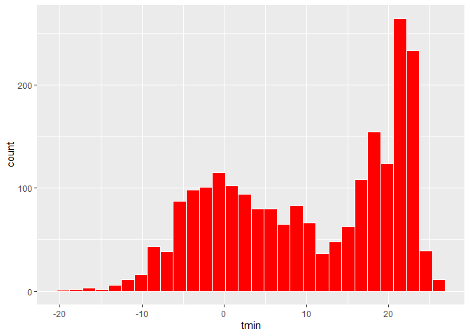
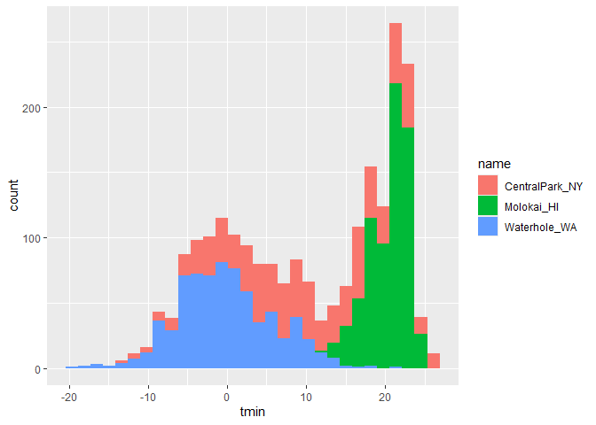

Data Visualization I
================
Maliha Safdar
2025-09-25

``` r
library(tidyverse)
```

    ## ── Attaching core tidyverse packages ──────────────────────── tidyverse 2.0.0 ──
    ## ✔ dplyr     1.1.4     ✔ readr     2.1.5
    ## ✔ forcats   1.0.0     ✔ stringr   1.5.1
    ## ✔ ggplot2   4.0.0     ✔ tibble    3.3.0
    ## ✔ lubridate 1.9.4     ✔ tidyr     1.3.1
    ## ✔ purrr     1.1.0     
    ## ── Conflicts ────────────────────────────────────────── tidyverse_conflicts() ──
    ## ✖ dplyr::filter() masks stats::filter()
    ## ✖ dplyr::lag()    masks stats::lag()
    ## ℹ Use the conflicted package (<http://conflicted.r-lib.org/>) to force all conflicts to become errors

``` r
library(ggridges)
library(p8105.datasets)
data("weather_df")
```

``` r
weather_df
```

    ## # A tibble: 2,190 × 6
    ##    name           id          date        prcp  tmax  tmin
    ##    <chr>          <chr>       <date>     <dbl> <dbl> <dbl>
    ##  1 CentralPark_NY USW00094728 2021-01-01   157   4.4   0.6
    ##  2 CentralPark_NY USW00094728 2021-01-02    13  10.6   2.2
    ##  3 CentralPark_NY USW00094728 2021-01-03    56   3.3   1.1
    ##  4 CentralPark_NY USW00094728 2021-01-04     5   6.1   1.7
    ##  5 CentralPark_NY USW00094728 2021-01-05     0   5.6   2.2
    ##  6 CentralPark_NY USW00094728 2021-01-06     0   5     1.1
    ##  7 CentralPark_NY USW00094728 2021-01-07     0   5    -1  
    ##  8 CentralPark_NY USW00094728 2021-01-08     0   2.8  -2.7
    ##  9 CentralPark_NY USW00094728 2021-01-09     0   2.8  -4.3
    ## 10 CentralPark_NY USW00094728 2021-01-10     0   5    -1.6
    ## # ℹ 2,180 more rows

### Make a basic scatterplot

``` r
ggplot(weather_df, aes(x = tmin, y = tmax)) # this is blank because we did not specify ggplot what to show so we have to add geom into this code
```

<!-- -->

``` r
ggplot(weather_df, aes(x = tmin, y = tmax)) + 
  geom_point() # Now we have a visualization of the scatterplot
```

    ## Warning: Removed 17 rows containing missing values or values outside the scale range
    ## (`geom_point()`).

<!-- -->

### The code below produces the same thing but helpful if you want to do some pre-processing before making your plot but don’t want to save the intermediate data

``` r
weather_df |>
  ggplot(aes(x = tmin, y = tmax)) + 
  geom_point()
```

    ## Warning: Removed 17 rows containing missing values or values outside the scale range
    ## (`geom_point()`).

<!-- -->

``` r
### Better styling with this code

ggp_weather = 
  weather_df |>
  ggplot(aes(x = tmin, y = tmax)) 

ggp_weather + geom_point()
```

    ## Warning: Removed 17 rows containing missing values or values outside the scale range
    ## (`geom_point()`).

<!-- -->
`There are some missing rows which we want to find`

``` r
weather_df |>
  filter(is.na(tmax))
```

    ## # A tibble: 17 × 6
    ##    name         id          date        prcp  tmax  tmin
    ##    <chr>        <chr>       <date>     <dbl> <dbl> <dbl>
    ##  1 Molokai_HI   USW00022534 2022-05-31    NA    NA    NA
    ##  2 Waterhole_WA USS0023B17S 2021-03-09    NA    NA    NA
    ##  3 Waterhole_WA USS0023B17S 2021-12-07    51    NA    NA
    ##  4 Waterhole_WA USS0023B17S 2021-12-31     0    NA    NA
    ##  5 Waterhole_WA USS0023B17S 2022-02-03     0    NA    NA
    ##  6 Waterhole_WA USS0023B17S 2022-08-09    NA    NA    NA
    ##  7 Waterhole_WA USS0023B17S 2022-08-10    NA    NA    NA
    ##  8 Waterhole_WA USS0023B17S 2022-08-11    NA    NA    NA
    ##  9 Waterhole_WA USS0023B17S 2022-08-12    NA    NA    NA
    ## 10 Waterhole_WA USS0023B17S 2022-08-13    NA    NA    NA
    ## 11 Waterhole_WA USS0023B17S 2022-08-14    NA    NA    NA
    ## 12 Waterhole_WA USS0023B17S 2022-08-15    NA    NA    NA
    ## 13 Waterhole_WA USS0023B17S 2022-08-16    NA    NA    NA
    ## 14 Waterhole_WA USS0023B17S 2022-08-17    NA    NA    NA
    ## 15 Waterhole_WA USS0023B17S 2022-08-18    NA    NA    NA
    ## 16 Waterhole_WA USS0023B17S 2022-08-19    NA    NA    NA
    ## 17 Waterhole_WA USS0023B17S 2022-12-31    76    NA    NA

`None of these rows that are missing are for CentralPark_NY.`

`ggplot is friendly to the pipe operator so we can use that.` \###
Advaced Scatterplot \##### We are adding color to different names of
variables to identify them on the scatterplot

``` r
ggplot(weather_df, aes(x = tmin, y = tmax)) + 
  geom_point(aes(color = name))
```

    ## Warning: Removed 17 rows containing missing values or values outside the scale range
    ## (`geom_point()`).

<!-- -->
\### Next add a smooth curve and make the data points a bit transparent.
Adding size makes the graph wider

``` r
ggplot(weather_df, aes(x = tmin, y = tmax)) + 
  geom_point(aes(color = name), alpha = .5, size = 0.8) +
  geom_smooth(se = FALSE)
```

    ## `geom_smooth()` using method = 'gam' and formula = 'y ~ s(x, bs = "cs")'

    ## Warning: Removed 17 rows containing non-finite outside the scale range
    ## (`stat_smooth()`).

    ## Warning: Removed 17 rows containing missing values or values outside the scale range
    ## (`geom_point()`).

<!-- -->

``` r
ggplot(weather_df, aes(x = tmin, y = tmax)) + 
  geom_point(aes(color = name), alpha = .5, size = 0.8) +
  geom_smooth(se = FALSE)
```

    ## `geom_smooth()` using method = 'gam' and formula = 'y ~ s(x, bs = "cs")'

    ## Warning: Removed 17 rows containing non-finite outside the scale range
    ## (`stat_smooth()`).
    ## Removed 17 rows containing missing values or values outside the scale range
    ## (`geom_point()`).

<!-- -->
`The curve gives a sense of the relationship between variables, and the transparency shows where data are overlapping. I can’t help but notice, though, that the smooth curve is for all the data but the colors are only for the scatterplot. Turns out that this is due to where I defined the mappings. The X and Y mappings apply to the whole graphic, but color is currently geom-specific. Sometimes you want or need to do this, but for now I don’t like it. If I’m honest, I’m also having a hard time seeing everything on one plot, so I’m going to add facet based on name as well.`

``` r
ggplot(weather_df, aes(x = tmin, y = tmax, color = name)) + 
  geom_point(alpha = .5, size = 0.8) +
  geom_smooth(se = FALSE) + 
  facet_grid(. ~ name)
```

    ## `geom_smooth()` using method = 'loess' and formula = 'y ~ x'

    ## Warning: Removed 17 rows containing non-finite outside the scale range
    ## (`stat_smooth()`).

    ## Warning: Removed 17 rows containing missing values or values outside the scale range
    ## (`geom_point()`).

<!-- -->
`We basically created three scatterplots, and made a smooth curve for each one.`

##### Next we want to learn about the minimum and maximum temperature in relation to time of the year. And we also want to learn about precipitation.

``` r
ggplot(weather_df, aes(x = date, y = tmax, color = name)) + 
  geom_point(aes(size = prcp), alpha = .5, size = 0.8) +
  geom_smooth(se = FALSE) + 
  facet_grid(. ~ name)
```

    ## `geom_smooth()` using method = 'loess' and formula = 'y ~ x'

    ## Warning: Removed 17 rows containing non-finite outside the scale range
    ## (`stat_smooth()`).

    ## Warning: Removed 17 rows containing missing values or values outside the scale range
    ## (`geom_point()`).

<!-- -->
`Way more interesting! You get a whole range of temperatures in Central Park (sometimes it’s maybe too hot); it’s more temperate near Seattle but it rains all the time; and Molokai is great except for that a few (relatively) cold, rainy days.`

`Making a somewhat more interesting scatterplot.`

``` r
weather_df |>
  ggplot(aes(x = tmin, y = tmax,
             color = name)) + 
  geom_point(aes(size = prcp), alpha = 0.3) + 
  geom_smooth(se = FALSE) + 
  facet_grid(.~ name)
```

    ## `geom_smooth()` using method = 'loess' and formula = 'y ~ x'

    ## Warning: Removed 17 rows containing non-finite outside the scale range
    ## (`stat_smooth()`).

    ## Warning: Removed 19 rows containing missing values or values outside the scale range
    ## (`geom_point()`).

<!-- -->

### Learning Assessment 1

``` r
weather_df |>
  filter(name == "CentralPark_NY") |>
  mutate(
    tmax_fahr = tmax * (9/5) + 32,
    tmin_fahr = tmin * (9/5) + 32
  ) |>
  ggplot(aes(x = tmin_fahr, y = tmax_fahr)) + 
  geom_point() +
  geom_smooth(se = FALSE, method = "lm")
```

    ## `geom_smooth()` using formula = 'y ~ x'

<!-- -->

### Small things

``` r
weather_df |>
  ggplot(aes(x = tmin, y= tmax, color = name, shape = name)) + 
# geom_point(alpha = 0.3) + 
  geom_smooth(se =FALSE)
```

    ## `geom_smooth()` using method = 'loess' and formula = 'y ~ x'

    ## Warning: Removed 17 rows containing non-finite outside the scale range
    ## (`stat_smooth()`).

<!-- -->

``` r
weather_df |> 
  ggplot(aes(x = tmin, y = tmax)) + 
  geom_point()
```

    ## Warning: Removed 17 rows containing missing values or values outside the scale range
    ## (`geom_point()`).

<!-- -->

``` r
### Changing the color of the scar=tterplot
weather_df |>
  ggplot(aes(x = tmin, y = tmax )) + 
  geom_point(color = "#086bfd")
```

    ## Warning: Removed 17 rows containing missing values or values outside the scale range
    ## (`geom_point()`).

<!-- -->
\### Univariate plots

``` r
weather_df |>
  ggplot(aes(x= tmin)) +
  geom_histogram(color = "white", fill = "red")
```

    ## `stat_bin()` using `bins = 30`. Pick better value `binwidth`.

    ## Warning: Removed 17 rows containing non-finite outside the scale range
    ## (`stat_bin()`).

<!-- -->

`we can overlap the distributions too.`

``` r
weather_df |>
  ggplot(aes(x = tmin, fill = name)) + 
  geom_histogram()
```

    ## `stat_bin()` using `bins = 30`. Pick better value `binwidth`.

    ## Warning: Removed 17 rows containing non-finite outside the scale range
    ## (`stat_bin()`).

<!-- -->
`it makes it hard to read it for each of the different areas. SO it is betetr to use the facet_grid code.`

``` r
weather_df |>
ggplot(aes(x = tmin, fill = name)) + 
  geom_histogram() +
  facet_grid(name ~ .)
```

    ## `stat_bin()` using `bins = 30`. Pick better value `binwidth`.

    ## Warning: Removed 17 rows containing non-finite outside the scale range
    ## (`stat_bin()`).

<!-- -->

### Making a density plot.

### Making a boxplot

``` r
weather_df |>
  ggplot(aes(x = name, y = tmin)) + 
  geom_boxplot(aes(fill = name))
```

    ## Warning: Removed 17 rows containing non-finite outside the scale range
    ## (`stat_boxplot()`).

<!-- -->

### Making a ridgeplot.

`It is similar to density plots but how is it different?`

``` r
weather_df |>
  ggplot(aes(x = tmin, y = name)) + 
  geom_density_ridges()
```

    ## Picking joint bandwidth of 1.41

    ## Warning: Removed 17 rows containing non-finite outside the scale range
    ## (`stat_density_ridges()`).

<!-- -->

### Odds and Ends
