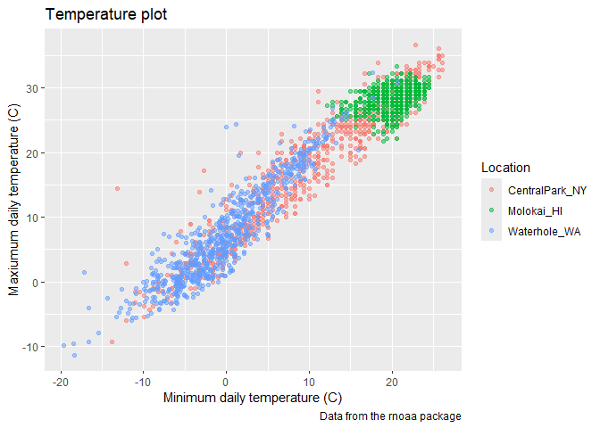
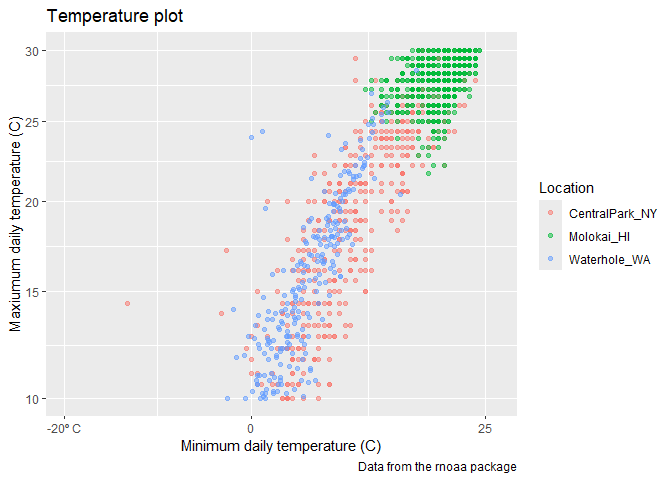
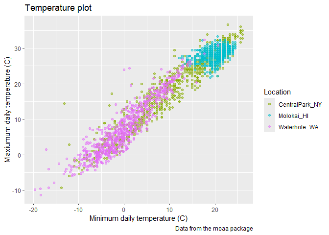
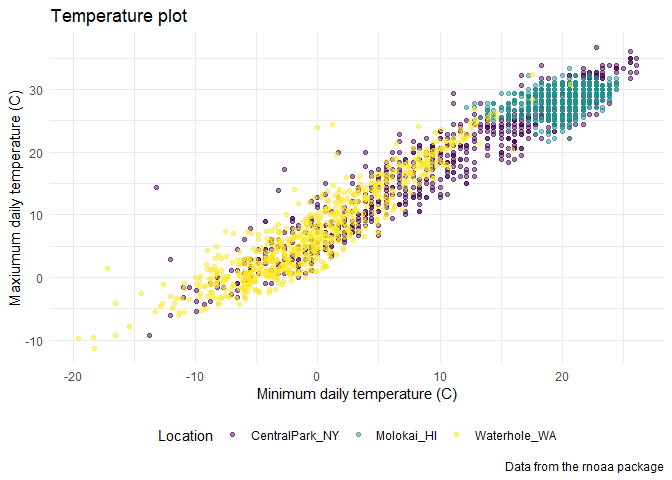
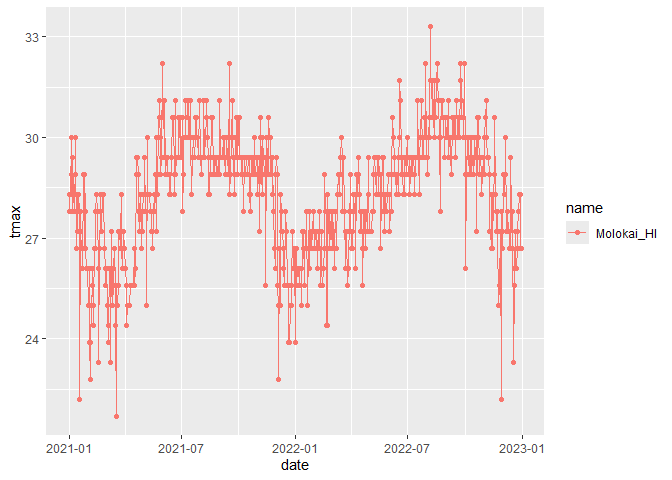
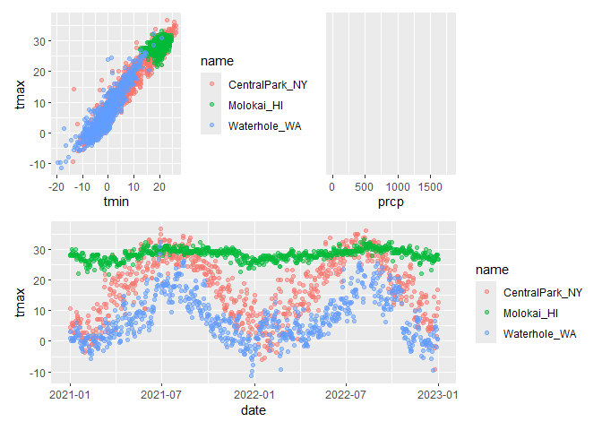
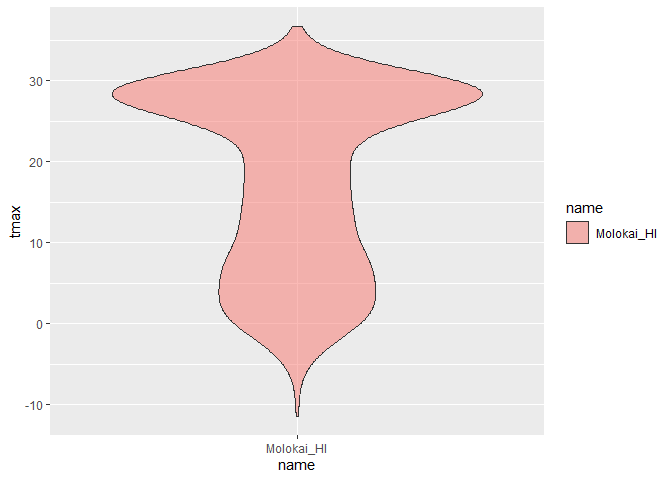
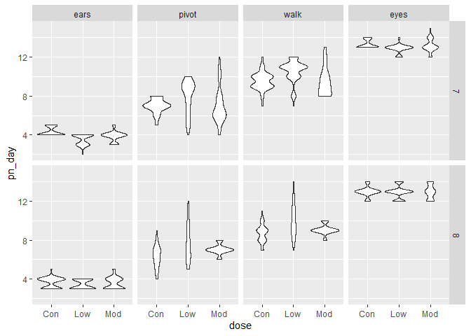
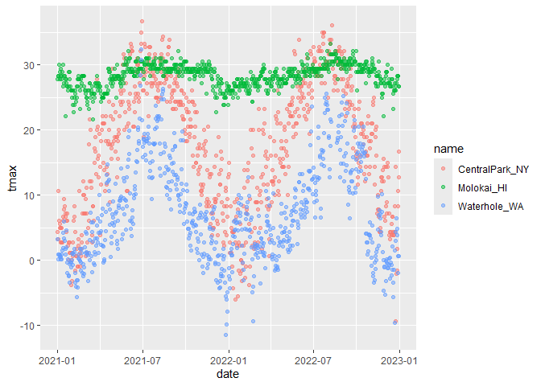

Visualization II with ggplot2
================
Maliha Safdar
2025-09-30

``` r
library(tidyverse)
```

    ## ── Attaching core tidyverse packages ──────────────────────── tidyverse 2.0.0 ──
    ## ✔ dplyr     1.1.4     ✔ readr     2.1.5
    ## ✔ forcats   1.0.0     ✔ stringr   1.5.1
    ## ✔ ggplot2   4.0.0     ✔ tibble    3.3.0
    ## ✔ lubridate 1.9.4     ✔ tidyr     1.3.1
    ## ✔ purrr     1.1.0     
    ## ── Conflicts ────────────────────────────────────────── tidyverse_conflicts() ──
    ## ✖ dplyr::filter() masks stats::filter()
    ## ✖ dplyr::lag()    masks stats::lag()
    ## ℹ Use the conflicted package (<http://conflicted.r-lib.org/>) to force all conflicts to become errors

``` r
library(patchwork)
```

`We’ll still work with NOAA weather data, which is loaded using the same code as in Visualization Pt 1.`

``` r
library(p8105.datasets)
data(weather_df)
```

`Revist the scatterplot tmax against tmin made in Visualization I.`

``` r
weather_df |> 
  ggplot(aes(x = tmin, y = tmax)) + 
  geom_point(aes(color = name), alpha = .5)
```

    ## Warning: Removed 17 rows containing missing values or values outside the scale range
    ## (`geom_point()`).

<!-- -->

### Labels

`One of the most important things you can do is provide informative axis labels, plot titles, and captions, all of which can be controlled using labs().`

``` r
weather_df |> 
  ggplot(aes(x = tmin, y = tmax)) + 
  geom_point(aes(color = name), alpha = .5) + 
  labs(
    title = "Temperature plot",
    x = "Minimum daily temperature (C)",
    y = "Maxiumum daily temperature (C)",
    color = "Location",
    caption = "Data from the rnoaa package",
    color = "Location"
  )
```

    ## Warning: Removed 17 rows containing missing values or values outside the scale range
    ## (`geom_point()`).

<!-- -->

### Scales

`you’ll occasionally want control over the location and specification of tick marks on the X or Y axis. These can be manipulated in scale_x_* and scale_y_* where * depends on the type of variable mapped to the x and y aesthetics (i.e. continuous vs discrete).`

``` r
weather_df |> 
  ggplot(aes(x = tmin, y = tmax)) + 
  geom_point(aes(color = name), alpha = .5) + 
  labs(
    title = "Temperature plot",
    x = "Minimum daily temperature (C)",
    y = "Maxiumum daily temperature (C)",
    color = "Location",
    caption = "Data from the rnoaa package") + 
  scale_x_continuous(
    breaks = c(-20, 0, 25), 
    labels = c("-20º C", "0", "25")) +
  scale_y_continuous(
    trans = "sqrt",
    limits = c(10,30)
  )
```

    ## Warning in transformation$transform(x): NaNs produced

    ## Warning in scale_y_continuous(trans = "sqrt", limits = c(10, 30)): sqrt
    ## transformation introduced infinite values.

    ## Warning: Removed 843 rows containing missing values or values outside the scale range
    ## (`geom_point()`).

<!-- -->

`for scale_x_ continuos, continuos is chosen because we are changing the x-axis.`

`Using color hues.`

``` r
weather_df |> 
  ggplot(aes(x = tmin, y = tmax)) + 
  geom_point(aes(color = name), alpha = .5) + 
  labs(
    title = "Temperature plot",
    x = "Minimum daily temperature (C)",
    y = "Maxiumum daily temperature (C)",
    color = "Location",
    caption = "Data from the rnoaa package") + 
  scale_color_hue(h = c(100, 300))
```

    ## Warning: Removed 17 rows containing missing values or values outside the scale range
    ## (`geom_point()`).

<!-- -->
`better to use the viridis package instead for better hue colors of the graph.`

``` r
library(viridis)
```

    ## Loading required package: viridisLite

``` r
library(viridisLite)
```

``` r
ggp_temp_plot = 
  weather_df |> 
  ggplot(aes(x = tmin, y = tmax)) + 
  geom_point(aes(color = name), alpha = .5) + 
  labs(
    title = "Temperature plot",
    x = "Minimum daily temperature (C)",
    y = "Maxiumum daily temperature (C)",
    color = "Location",
    caption = "Data from the rnoaa package"
  ) + 
  viridis::scale_color_viridis(
    name = "Location", 
    discrete = TRUE
  )
```

`Update my base plot`

``` r
ggp_temp_plot +
  theme_minimal() +
  theme(legend.position = "bottom")
```

    ## Warning: Removed 17 rows containing missing values or values outside the scale range
    ## (`geom_point()`).

<!-- -->

### Adding data in geoms

``` r
central_park_df = 
  weather_df |>
  filter(name == "Molokai_HI")

ggplot(data = central_park_df, aes(x = date, y = tmax, color = name)) + 
  geom_point() +
  geom_line(data = central_park_df)
```

    ## Warning: Removed 1 row containing missing values or values outside the scale range
    ## (`geom_point()`).

<!-- -->

### `Patchwork`

`Make three plots and combine using patchwork.`

``` r
ggp_tmax_tmin = 
  weather_df |>
  ggplot(aes(x = tmin, y= tmax, color = name)) +
  geom_point(alpha = 0.5)

ggp_prec_density = 
  weather_df |>
  filter(prcp > 0) |>
  ggplot(aes(x = prcp, fill = name)) +
  theme(legend.position = "bottom")

ggp_temp_season = 
  weather_df |>
  ggplot(aes(x = date, y=tmax, color = name)) +
  geom_point(alpha = 0.5)
  geom_smooth(se = FALSE)
```

    ## geom_smooth: na.rm = FALSE, orientation = NA, se = FALSE
    ## stat_smooth: na.rm = FALSE, orientation = NA, se = FALSE
    ## position_identity

``` r
  (ggp_tmax_tmin + ggp_prec_density)/ ggp_temp_season
```

    ## Warning: Removed 17 rows containing missing values or values outside the scale range
    ## (`geom_point()`).
    ## Removed 17 rows containing missing values or values outside the scale range
    ## (`geom_point()`).

<!-- -->

### Data Manipulation

`Let's make temperature violin plots.`

``` r
weather_df |>
  mutate(name = fct_relevel("Molokai_HI", "CentralPrak_NY", "Waterhole_WA")) |>
  ggplot(aes(x = name, y = tmax, fill = name)) + 
  geom_violin(alpha = 0.5)
```

    ## Warning: There was 1 warning in `mutate()`.
    ## ℹ In argument: `name = fct_relevel("Molokai_HI", "CentralPrak_NY",
    ##   "Waterhole_WA")`.
    ## Caused by warning:
    ## ! 2 unknown levels in `f`: CentralPrak_NY and Waterhole_WA

    ## Warning: Removed 17 rows containing non-finite outside the scale range
    ## (`stat_ydensity()`).

<!-- -->

`The above graph is supposed to have three graphs with Molokai being first one.`

``` r
weather_df |>
  mutate(name = fct_reorder(name,tmax)) |>
  ggplot(aes(x = name, y = tmax, fill = name)) +
  geom_violin(alpha = 0.5)
```

    ## Warning: There was 1 warning in `mutate()`.
    ## ℹ In argument: `name = fct_reorder(name, tmax)`.
    ## Caused by warning:
    ## ! `fct_reorder()` removing 17 missing values.
    ## ℹ Use `.na_rm = TRUE` to silence this message.
    ## ℹ Use `.na_rm = FALSE` to preserve NAs.

    ## Warning: Removed 17 rows containing non-finite outside the scale range
    ## (`stat_ydensity()`).

<!-- -->

#### `What about data tidiness?`

``` r
pulse_df = 
  haven::read_sas("./data/public_pulse_data.sas7bdat") |>
  janitor::clean_names() |>
  pivot_longer(
    bdi_score_bl:bdi_score_12m,
    names_to = "visit", 
    names_prefix = "bdi_score_",
    values_to = "bdi") |>
  select(id, visit, everything()) |>
  mutate(
    visit = recode(visit, "bl" = "00m"),
    visit = factor(visit, levels = str_c(c("00", "01", "06", "12"), "m"))) |>
  arrange(id, visit)

ggplot(pulse_df, aes(x = visit, y = bdi)) + 
  geom_boxplot()
```

    ## Warning: Removed 879 rows containing non-finite outside the scale range
    ## (`stat_boxplot()`).

<!-- -->

\`1. import pups dataframe

``` r
pups_df = 
  read.csv("data/FAS_pups.csv", na = c("NA", ".",""), skip = 3) |>
  janitor::clean_names() |>
  mutate(
    sex = case_match(
      sex,
      1 ~ "male",
      2 ~ "female"
    )
  )

litters_df =
  read.csv("data/FAS_litters.csv", na = c("NA",".", "")) |>
  janitor::clean_names()|>
  separate(group, into = c ("dose", "tx_day"), sep = 3)

fas_df =
  left_join(pups_df, litters_df, by = "litter_number")

fas_df |>
  select(pd_ears:tx_day) |>
  pivot_longer(
    pd_ears:pd_walk,
    names_to = "outcome",
    names_prefix = "pd_",
    values_to = "pn_day") |>
  mutate(outcome = fct_reorder(outcome, pn_day)) |>
  drop_na() |>
  ggplot(aes(x = dose, y = pn_day)) +
  geom_violin() +
  facet_grid(tx_day ~ outcome)
```

    ## Warning: There was 1 warning in `mutate()`.
    ## ℹ In argument: `outcome = fct_reorder(outcome, pn_day)`.
    ## Caused by warning:
    ## ! `fct_reorder()` removing 44 missing values.
    ## ℹ Use `.na_rm = TRUE` to silence this message.
    ## ℹ Use `.na_rm = FALSE` to preserve NAs.

<!-- -->

### Learning Assessment

``` r
weather_df |> 
  ggplot(aes(x = date, y = tmax)) + 
  geom_point(aes(color = name), alpha = .5)
```

    ## Warning: Removed 17 rows containing missing values or values outside the scale range
    ## (`geom_point()`).

<!-- -->

``` r
  labs(
    title = "Temperature against Date",
    x = "Date",
    y = "Maxiumum daily temperature (C)",
    color = "Location",
    caption = "Data from the rnoaa package") + 
  scale_x_continuous(
    breaks = c(-20, 0, 25), 
    labels = c("-20º C", "0", "25")) +
  scale_y_continuous(
    trans = "sqrt",
    limits = c(10,30)
  )
```

    ## NULL
